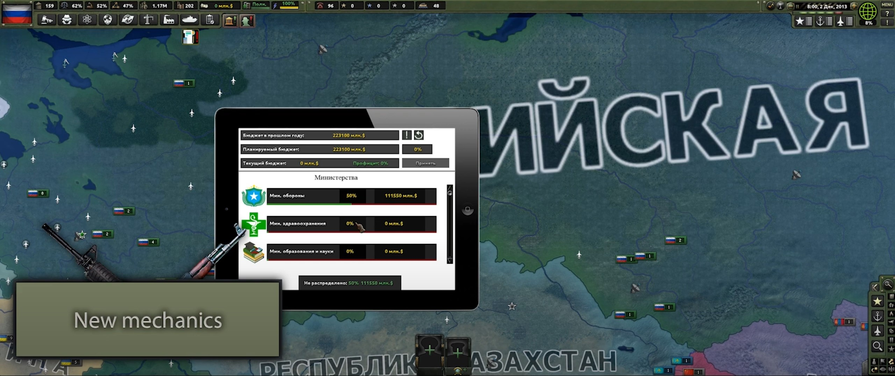
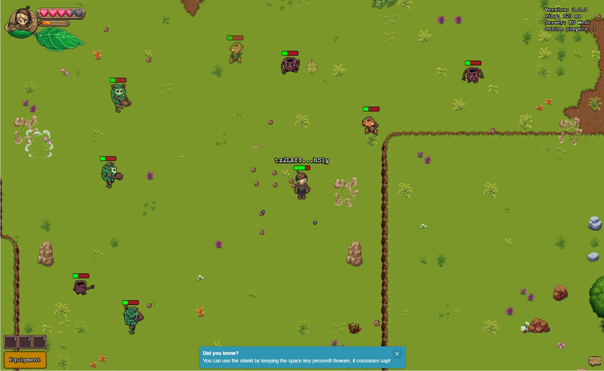

# Hey, I'm Sukhrob 👋

**Senior Full-Stack Engineer | .NET · TypeScript · Python | CV Researcher**

I build production-ready web apps, APIs, real-time systems, and games—with a research focus on computer vision and deep learning. I care about clean architecture, performance, and shipping things that work.

[](https://www.linkedin.com/in/suxrobgm)
[](https://t.me/suxrobgm)
[](https://suxrobgm.net)

---

### TL;DR

```text
9+ years shipping software across healthcare, logistics, gaming, and real estate
Full-stack: React/Next.js • ASP.NET Core • NestJS • FastAPI
Cloud: AWS • Azure • Docker • K8s
Realtime: SignalR • WebSockets • gRPC • Colyseus
AI/CV: PyTorch • OpenCV • YOLO • Medical Imaging (DICOM/OHIF)
Games: Unity • Phaser • Godot
```

> Full details in my [resume →](https://suxrobgm.net/resume)

---

### Research Projects

**[MelanomaNet](https://github.com/suxrobgm/explainable-melanoma)** — Explainable deep learning for skin lesion classification  
Multi-class classification across all 9 ISIC 2019 categories with GradCAM++ attention visualization and automated ABCDE clinical feature extraction for interpretability.  
`Python · PyTorch · EfficientNet V2 · GradCAM++ · OpenCV`

**[LightDepth](https://github.com/suxrobgm/lightdepth)** — Lightweight monocular depth estimation  
ResNet18 encoder with U-Net decoder, achieving 42% fewer parameters than Depth Anything V2, 72% faster inference, and superior error metrics on NYU Depth V2.  
`Python · PyTorch · ResNet18 · U-Net`

**[FSRCNN](https://github.com/suxrobgm/fsrcnn)** — Accelerating super-resolution CNN  
Implementation achieving 40× speedup over SRCNN with end-to-end learned upsampling filters supporting 2×/3×/4× scaling (+1.78 dB PSNR on Set5).  
`Python · PyTorch · Mixed Precision Training`

---

Now it matches the Featured Projects style. Let me know if you need anything else!

---

### Featured Projects

**[Logistics TMS](https://github.com/suxrobgm/logistics-app)** — Enterprise multi-tenant SaaS for fleet management  
Trip/load planning, driver ops, live tracking, per-tenant DB isolation. Clean DDD architecture.  
`C# · ASP.NET Core · EF Core · PostgreSQL · Angular · Blazor · SignalR · Docker`

**[Med Image Scanner](https://github.com/suxrobgm/med-image-scanner)** — DICOM viewer with AI-powered analysis  
Connects to hospital PACS, provides measurement/segmentation tools and disease-detection overlays. HIPAA-ready patterns.  
`Python · FastAPI · Next.js · PyTorch · OpenCV · OHIF Viewer · PostgreSQL`

**[Blazor Form Builder](https://github.com/suxrobgm/blazor-form-builder)** — Drag-and-drop form designer  
Outputs JSON schema with runtime renderer—speeds up admin dashboard development.  
`C# · Blazor · ASP.NET Core · SQL Server`

**[Bookshelf Scanner](https://github.com/suxrobgm/bookshelf-scanner)** — CV + LLM book detection pipeline  
Detects book spines from photos and extracts titles/authors using YOLO segmentation + vision-language model.  
`Python · FastAPI · YOLO · Moondream2 · PyTorch · Angular`

---

### Games

<table>
<tr>
<td width="50%">

**Hearts of Iron IV: Economic Crisis**  
Large-scale mod with custom mechanics, AI behaviors, and balance systems.  
[Steam Workshop](https://steamcommunity.com/sharedfiles/filedetails/?id=2000532465) · [Releases](https://github.com/Economic-Crisis/Public-releases)



</td>
<td width="50%">

**Chestnut (MMO)**  
PvP/PvE real-time MMO with authoritative server, custom physics, and sync.  
[Play →](https://www.chest-nut.io)



</td>
</tr>
<tr>
<td width="50%">

**ChessMate**  
Online chess platform with AI opponents and PvP matchmaking.  
[Repo](https://github.com/suxrobGM/online-chess)


</td>
<td width="50%">

**Maze**  
2D puzzle game with AI pathfinding and level progression.  
[Repo](https://github.com/suxrobGM/maze-godot)


</td>
</tr>
</table>

---

### GitHub Stats


---

### Let's connect

Open to freelance projects, collaborations, or just chatting about **.NET**, **TypeScript**, **computer vision**, or **game dev**.

[](https://www.linkedin.com/in/suxrobgm)
[](https://t.me/suxrobgm)
